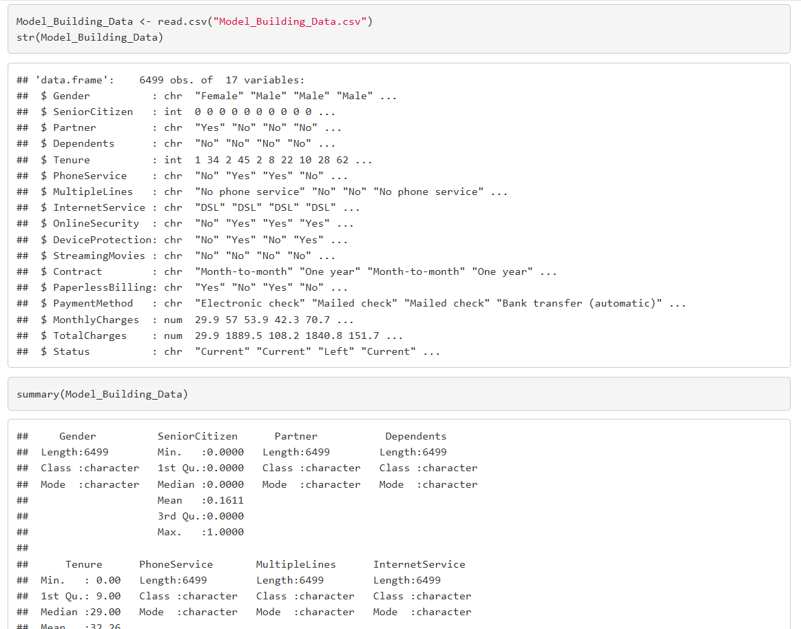
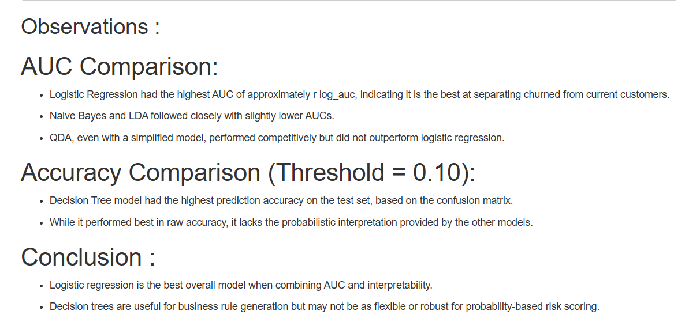
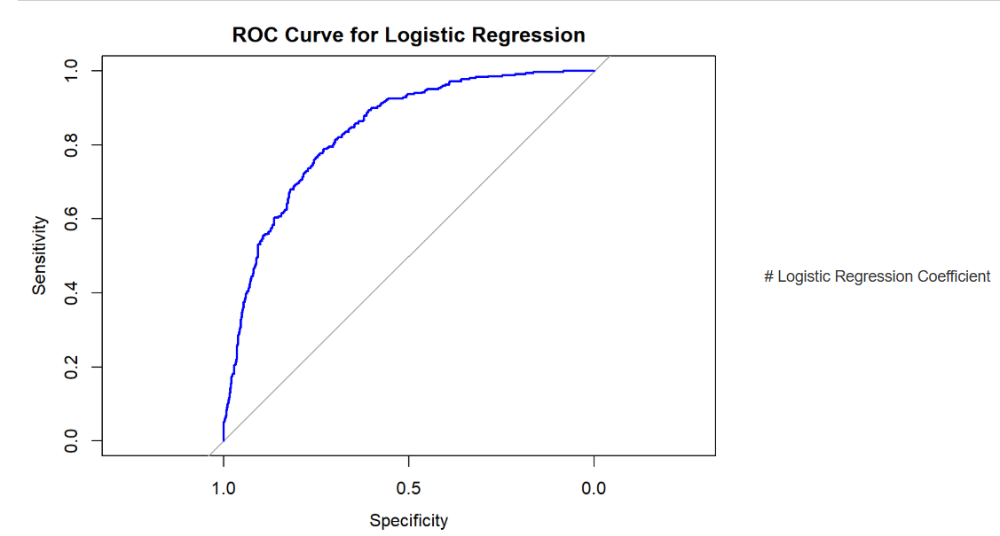
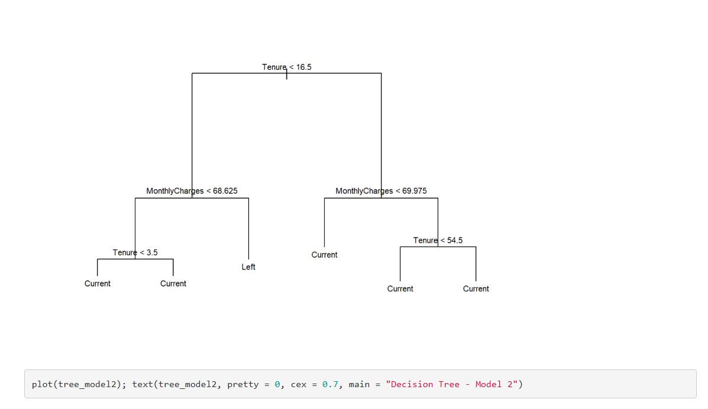
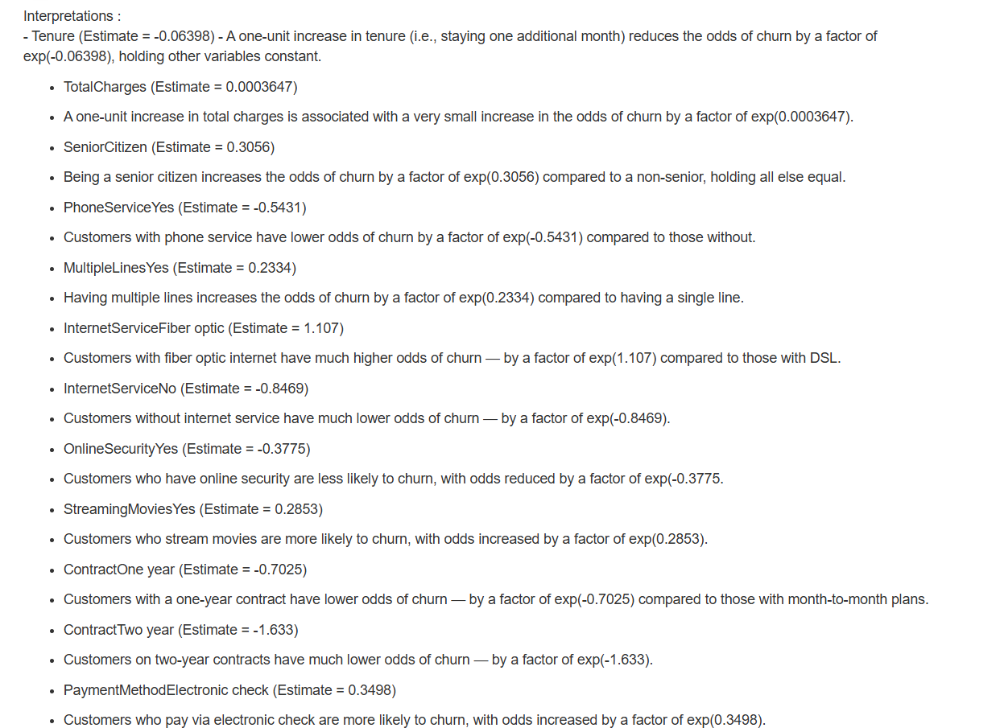

# Customer Churn Prediction Using R

## Project Overview

Customer churn is one of the most important business challenges in subscription-based industries. This project analyzes customer behavior data to identify factors that influence churn and evaluate predictive models that support customer retention decisions.

Using a telecommunications dataset containing 6,488 customer records and 17 variables, multiple classification techniques were developed and compared, including Logistic Regression, Naive Bayes, LDA, QDA, and Decision Tree models.

## Business Objective

* Identify key churn drivers
* Predict customers at risk of leaving
* Compare predictive model performance
* Estimate potential revenue impact
* Support retention strategy planning

## Key Results

* Analyzed 6,488 customer records
* Evaluated 5 classification models
* Logistic Regression achieved an AUC of 0.8355
* Decision Tree achieved 77.6% test accuracy
* Scored 500 implementation customers
* Identified 296 high-risk churn customers
* Estimated $21,448 monthly revenue exposure
* Estimated $7,764 net retention benefit opportunity

## Visualizations

### Data Overview

### Model Comparison

### ROC Curve

### Decision Tree Analysis

### Key Churn Drivers

## Tools & Technologies

* R
* Logistic Regression
* Naive Bayes
* LDA
* QDA
* Decision Trees
* ROC Analysis
* AUC Evaluation
* Business Analytics

